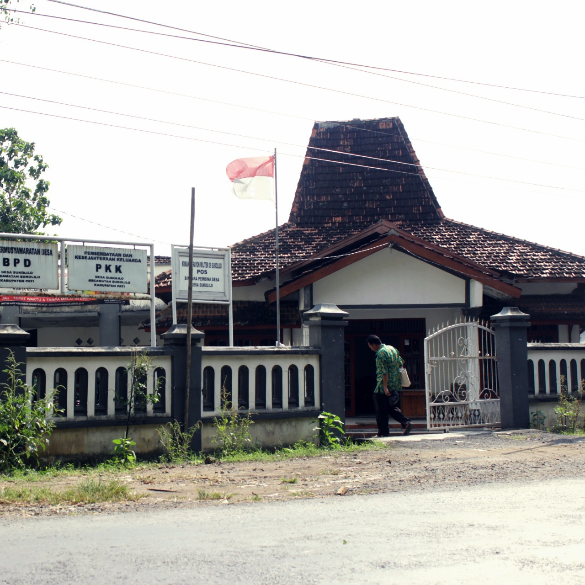

### DESAKU.id {.header-logo .container}

-   [Beranda](#)
-   [Tentang](#)
-   [Pilihan Desa](#)
-   [Hubungi Kami](#)

DESAKU.id
=========

### Majukan Desa Sejahterakan Rakyat

Potensi Fisik

Potensi Non-Fisik

Potensi Budaya

### Tentang DESAKU.id

Apa Sih DESAKU.id Itu ?
=======================

DESAKU.id adalah sebuah platform digital yang bertujuan untuk mengangkat
potensi - potensi yang ada di desa mulai dari potensi Fisik, potensi non
fisik hingga kebudayaan. Dengan adanya DESAKU.id diharapkan masyarakat
desa dapat memanfaatkan potensi desanya untuk menambah ekonomi
masyarakat desa selain itu, DESAKU.id diharapkan dapat mengenalkan dan
melestarikan budaya - budaya yang ada di desa.

### Pilihan Desa

-   **Nama Desa :** Sukolilo
-   **Alamat Desa :** Kecamatan Wajak, Kabupaten Malang, Provinsi Jawa
    Timur
-   **Kode Pos :** 65173

[Lebih Selengkapnya \>\>](https://www.google.com)

-   **Nama Desa :**
-   **Alamat Desa :**
-   **Kode Pos :**

-   **Nama Desa :**
-   **Alamat Desa :**
-   **Kode Pos :**

©2021 DESAKU.id
---------------
